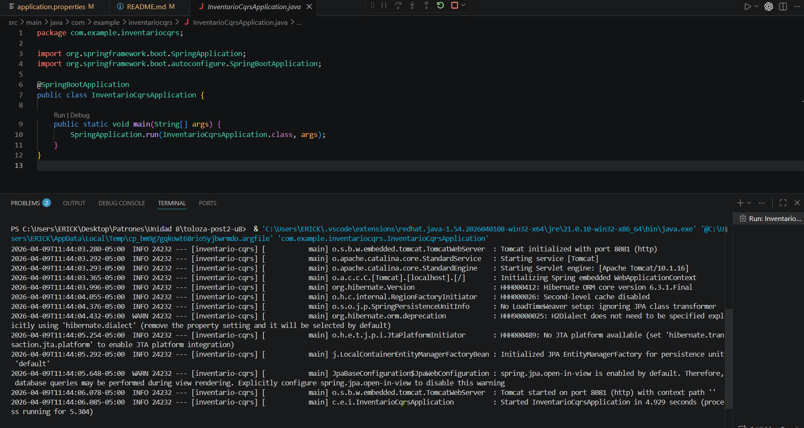

# Inventario CQRS - Patrón Arquitectónico

Sistema de Gestión de Inventario implementando el patrón **CQRS (Command Query Responsibility Segregation)** en Java con Spring Boot 3.x.

## 📋 Descripción del Proyecto

Este proyecto demuestra la implementación completa del patrón CQRS, separando explícitamente el stack de **escritura** (CommandHandlers) del stack de **lectura** (QueryHandlers). El objetivo es evidenciar cómo CQRS permite optimizar independientemente los modelos de lectura y escritura.

### COMANDO: Crear Producto
```bash
POST /api/inventario/productos
Content-Type: application/json

{
  "nombre": "Laptop Dell XPS",
  "categoria": "Electronica",
  "precioUnitario": 1200.50,
  "stockInicial": 10
}
```

**Respuesta (201 Created):**
```json
{
  "mensaje": "Producto creado exitosamente",
  "productoId": "b8d95206-004a-495f-bdb6-fbab164165be"
}
```

### COMANDO: Actualizar Stock
```bash
PATCH /api/inventario/productos/{id}/stock
Content-Type: application/json

{
  "productoId": "b8d95206-004a-495f-bdb6-fbab164165be",
  "delta": 5,
  "motivo": "compra"
}
```

Delta positivo: incrementa stock
Delta negativo: reduce stock

**Respuesta (200 OK):**
```json
{
  "mensaje": "Stock actualizado. Nuevo stock: 15. Motivo: compra",
  "productoId": "b8d95206-004a-495f-bdb6-fbab164165be"
}
```

### COMANDO: Eliminar Producto
```bash
DELETE /api/inventario/productos/{id}
```

**Respuesta (200 OK):**
```json
{
  "mensaje": "Producto b8d95206-004a-495f-bdb6-fbab164165be eliminado correctamente"
}
```

### QUERY: Listar Productos
```bash
GET /api/inventario/productos?soloDisponibles=false
```

**Respuesta (200 OK):**
```json
[
  {
    "id": "b8d95206-004a-495f-bdb6-fbab164165be",
    "nombre": "Laptop Dell XPS",
    "categoria": "Electronica",
    "precioUnitario": 1200.50,
    "stockDisponible": 12,
    "estadoStock": "DISPONIBLE"
  },
  {
    "id": "ba4da452-e7e4-423c-af87-087a37a15646",
    "nombre": "Mouse Logitech",
    "categoria": "Accesorios",
    "precioUnitario": 25.90,
    "stockDisponible": 3,
    "estadoStock": "BAJO"
  }
]
```

### QUERY: Buscar Producto Específico
```bash
GET /api/inventario/productos/{id}
```

**Respuesta (200 OK):**
```json
{
  "id": "b8d95206-004a-495f-bdb6-fbab164165be",
  "nombre": "Laptop Dell XPS",
  "categoria": "Electronica",
  "precioUnitario": 1200.50,
  "stockDisponible": 12,
  "estadoStock": "DISPONIBLE"
}
```

## Errores Posibles

### Stock Insuficiente
```bash
PATCH con delta que excede stock disponible
Respuesta (400 Bad Request):
{
  "error": "Stock Insuficiente",
  "mensaje": "Stock insuficiente para producto...",
  "status": 400,
  "stockActual": 10,
  "unidadesSolicitadas": 15
}
```

### Producto No Encontrado
```bash
GET con ID que no existe
Respuesta (404 Not Found):
{
  "error": "Producto No Encontrado",
  "mensaje": "Producto no encontrado: id-inexistente",
  "status": 404
}
```

## 📌 Estados del Stock

El modelo `ProductoView` calcula automáticamente el estado:
- **DISPONIBLE**: stock >= 5
- **BAJO**: 0 < stock < 5
- **AGOTADO**: stock == 0

### 4. Logs de Consola (Arquitectura Limpia)
Evidencia de la traza de ejecución de Spring Boot. Demuestra que el flujo de dependencias respeta los límites arquitectónicos (de afuera hacia adentro, sin saltarse las capas del dominio) y confirma la correcta ejecución de los adaptadores de persistencia (JPA/Hibernate) al guardar el `Aggregate Root`.

